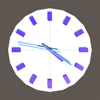

## catlikecoding_unity
Projects made with [Cat Like Coding tutorials](https://catlikecoding.com/unity/tutorials/) to learn Unity

#### Simple Clock: [Code](Simple%20Clock) | [Game Objects and Scripts: Creating a Clock](https://catlikecoding.com/unity/tutorials/basics/game-objects-and-scripts/)

